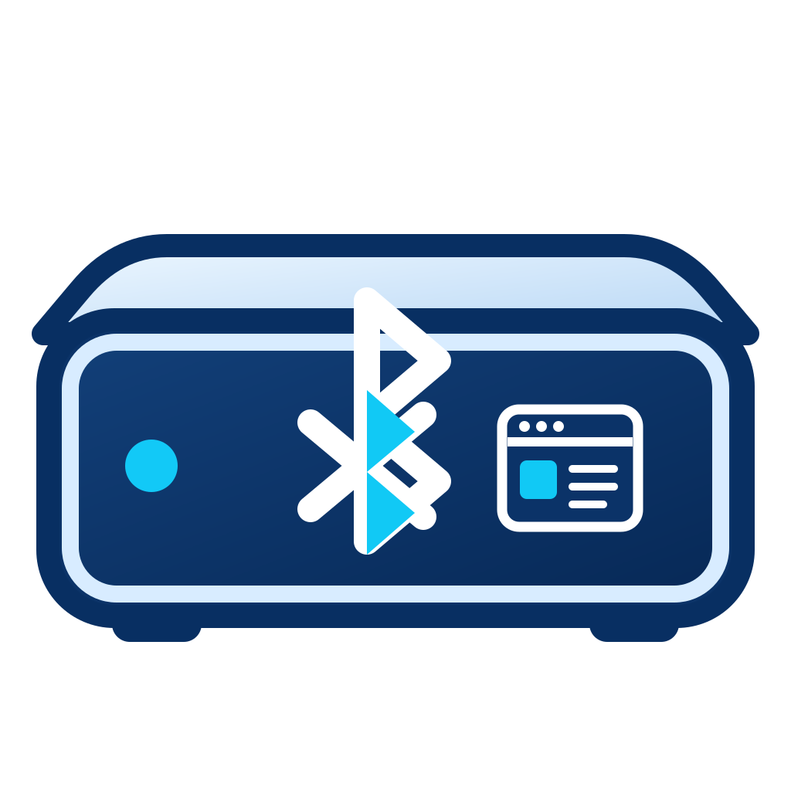

<p align="center">
  
</p>

<h1 align="center">CodePC Link</h1>

<p align="center">
  BLE discovery, network-status, and recovery companion for headless Linux mini-PC systems managed with Cockpit.
</p>

<p align="center">
  <a href="https://github.com/ami3go/codepc-link/actions/workflows/ci.yml"></a>
  <a href="https://github.com/ami3go/codepc-link/releases"></a>
  <a href="LICENSE"></a>
</p>

> **Status:** pre-alpha. Milestone A feasibility tooling is merged. The Milestone B read-only BLE core is implemented and under target-hardware validation; the Web Bluetooth client is still planned for Milestone C.

## What CodePC Link is for

A headless mini-PC can be connected to more than one network at once—for example Wi-Fi for Internet access and Ethernet for isolated local services. When you are standing next to the machine, discovering the correct current IP can be awkward.

CodePC Link adds a small out-of-band BLE path so a nearby phone can identify the machine and read useful network status without already knowing an IP address.

The intended flow is:

```text
Android Chrome / cached PWA
           │
           │ BLE GATT
           ▼
      CodePC Link
           │
      status / discovery
           │
           ▼
   choose reachable target
           │
           │ normal IP network
           ▼
        Cockpit
```

BLE is for discovery, diagnostics, and recovery. **Cockpit itself is not tunnelled over BLE.**

## Current BLE core

Milestone B provides:

- persistent device identity in `/var/lib/codepc-link/device-id`
- schema-v1 normalized status shared by CLI, BLE, and future Cockpit Management
- NetworkManager-backed Wi-Fi/Ethernet/bridge/bond normalization
- separate link, address, default-route, and Internet states
- permanent CodePC Link service/characteristic UUIDs
- read-only `SYSTEM_INFO` and `NETWORK_STATUS` GATT characteristics
- encrypted BLE reads by default
- 16 KiB payload guard and GATT long-read offset handling
- hardened systemd unit template

Real Android/BlueZ validation remains required before Milestone B is considered closed.

## Target capabilities

### v0.1 — read-only BLE + browser client

- discover a nearby CodePC Link device
- stable device identity independent of DHCP/IP changes
- show Wi-Fi and Ethernet interfaces simultaneously
- show all relevant IP addresses
- distinguish link state, assigned IP, default route, and Internet connectivity
- show Cockpit targets
- open Cockpit using normal IP networking
- cached PWA continues to show BLE status when Internet access is unavailable

### v0.2 — Cockpit Management

- CodePC Link Management page/tab inside the existing Cockpit integration
- Bluetooth adapter, daemon, and advertising status
- normalized Wi-Fi/Ethernet status from the same backend as BLE
- start/stop/restart `codepc-link.service` using Cockpit privilege elevation
- diagnostics without duplicating Cockpit Networking, Services, or Logs

### Later — secure recovery

Wi-Fi provisioning and other privileged BLE operations are deliberately deferred until authentication/authorization is designed and reviewed.

## Important design rules

- v0.1 BLE is read-only.
- Production BLE status reads require an encrypted BLE link.
- NetworkManager is the authoritative network-management source.
- BLE and Cockpit consume one normalized Management Core.
- The first IP returned by the OS is **not** assumed to be the correct address.
- Bridges/bonds may own valid addresses; container/veth interfaces should not clutter the primary UI.
- No generic shell-over-BLE endpoint.
- No arbitrary systemd-control-over-BLE endpoint.
- Passwords, tokens, and Wi-Fi credentials must never appear in BLE status or journald.

## Web Bluetooth limitation

The browser client must be loaded from an HTTPS secure origin. For v0.1, a new phone needs network access once to load/cache the CodePC Link PWA. After that, the cached PWA can communicate with the mini-PC over BLE even when the mini-PC has no Internet connection.

The initial browser target is **Android + Chrome/Chromium Web Bluetooth**. A native iOS client is a future option if browser-only Web Bluetooth remains unavailable there.

## Repository layout

```text
assets/                 Project artwork
src/codepc_link/        Python management core, diagnostics, and BLE service
tests/                  Automated tests and schema fixtures
docs/                   Architecture, protocol, roadmap, and release checklists
packaging/systemd/       systemd service definition
site/                    GitHub Pages / future Web Bluetooth PWA origin
.github/workflows/       CI, Pages, and tag-driven release automation
```

## Development

```bash
git clone https://github.com/ami3go/codepc-link.git
cd codepc-link
python -m venv .venv
. .venv/bin/activate
python -m pip install -U pip
python -m pip install -e '.[dev]'
ruff check src tests
pytest
```

Useful commands:

```bash
codepc-link doctor
codepc-link doctor --json
codepc-link status
codepc-link status --json
codepc-link advertise-test --seconds 30
codepc-link serve --insecure-development
```

`--insecure-development` deliberately disables encrypted-read protection and must only be used for local bring-up/testing.

## Documentation

- [Architecture](docs/ARCHITECTURE.md)
- [BLE protocol v1](docs/PROTOCOL.md)
- [Milestone A feasibility](docs/FEASIBILITY.md)
- [Roadmap](docs/ROADMAP.md)
- [Complications / release checklist](docs/COMPLICATIONS_CHECKLIST.md)
- [Contributing](CONTRIBUTING.md)
- [Security policy](SECURITY.md)
- [Release procedure](RELEASING.md)
- [Recommended repository settings](docs/REPOSITORY_SETTINGS.md)

Project site: **https://ami3go.github.io/codepc-link/** (requires the one-time Pages repository setting tracked in issue #6).

## Releases

Tags matching `v*.*.*` trigger the GitHub Release workflow. See [RELEASING.md](RELEASING.md).

## Security

Please do not report vulnerabilities in public issues. See [SECURITY.md](SECURITY.md) for the private reporting path and project security boundaries.

## License

CodePC Link is released under the [MIT License](LICENSE).
